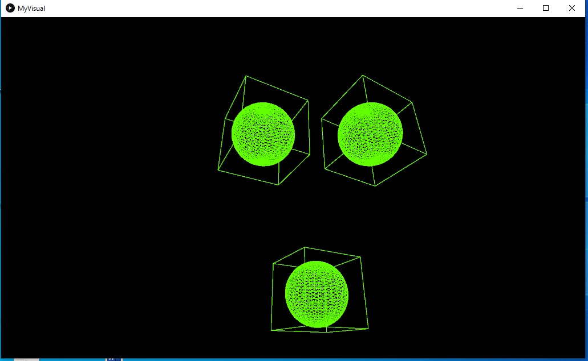
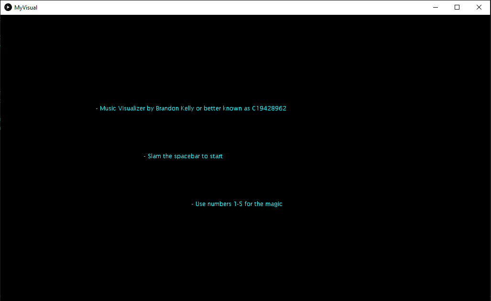
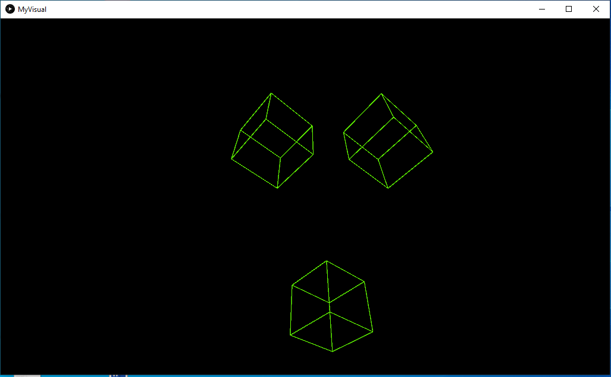
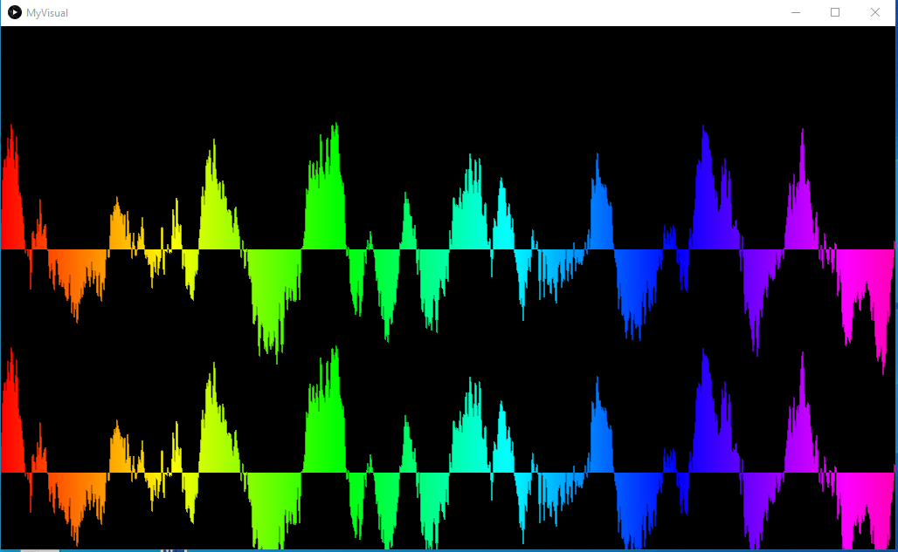
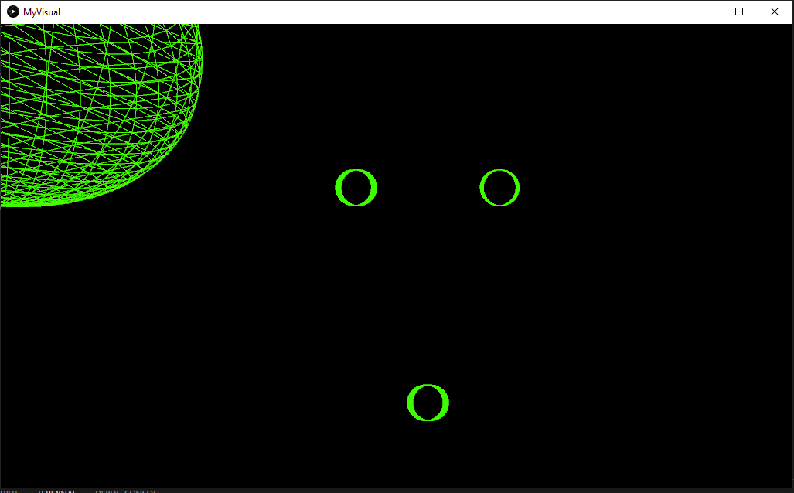

# Music Visualiser Project

Name: Brandon Kelly

Student Number: C19428962

# Description of the assignment
For my assignment I created a music visualiser that would produce different shapes and visuals which would respond the music (the amplitude). My goal the assignment was to create something simple but effective. The simplistic design not only provides an colourful visual exerience but also lets you feel the song. The song I have chosen is one of my favourites to just get in the zone but higher mind frame. Both 2D and 3D shapes are used.
# Instructions

- Press the space key to start the music
- To pause the music press 'p'
- To resert the music press 's'
- Start the visuals press 1, 2, 3 , 4
- Press 5 for the info menu

# How it works

- This is the setup method it is responsible for playing the song, the MP3 file is called.

- I also initialized every object for each visual class.

- Java processing libraries and minim used together with OOP to create the diffrent visuals and shapes.

      public void setup() 
      {

       startMinim();
        
       loadAudio("chill.mp3");  
        
      cv = new CubeVisual(this);
      wf = new WaveForm(this);
      s = new Sphere(this);
      c = new Circle(this);
      I= new Intro(this);
      }

- This is my MyVisual class, it extends the visual class and gets the information and communicates it to the class, otherwise known as inheritance.

      public class MyVisual extends Visual 
      {    
    
         CubeVisual cv;
         WaveForm wf;
         Sphere s;
         Circle c;
         Intro I;

- This is the keypressed method and is resposisble for controling the audio with start, pause and restart.

      public void keyPressed()
      {
        if (key == ' ')
        {
            getAudioPlayer().play();
        }
        if (key == 'p')
        {
            getAudioPlayer().pause();
        }
        if (key == 's')
        {
            getAudioPlayer().cue(0);
        }
     }

# What I am most proud of in the assignment

I am most proud of the boxed sphere visual and the concept of the 3 shapes. I struggled to come up with ideas for my visual, I knew I wanted something visually stimulation but at the same time not to over load you with too many different things at once. In terms of the sphere box visual I really like how it almost pops out of the screen with the music. The way you can switch between the diffrent shapes and they're in the same as before but something diffrent so its not like you have to change your focus

# Youtube Video
[Youtube](https://www.youtube.com/watch?v=ZV5wix2NhlI)

# Visuals

